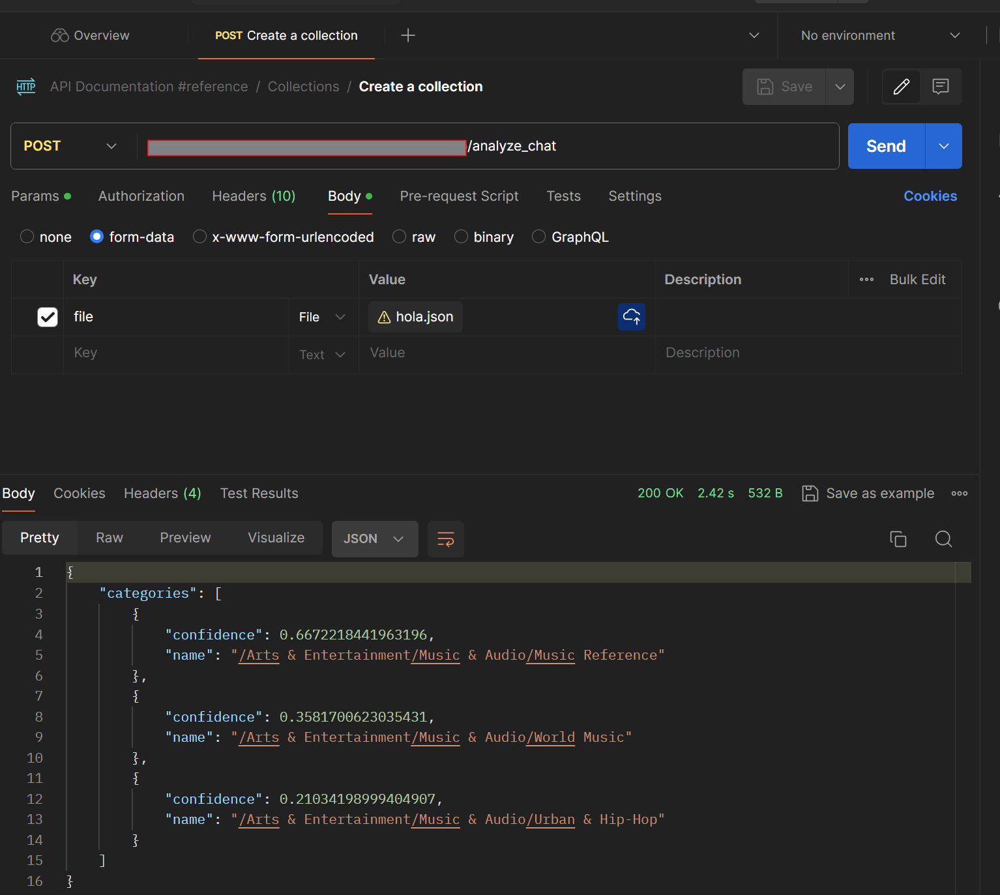

# API Categoriza texto.

API de Análisis de Chat

Esta API de Flask permite a los usuarios analizar el contenido textual de chats, específicamente mensajes de WhatsApp, convirtiéndolos desde formatos de texto o JSON a análisis de categorías utilizando Google Cloud Natural Language API.

- Características Principales

    Conversión de Texto a JSON: Convierte chats de texto de WhatsApp a una estructura JSON que contiene solo los mensajes.
    Detección Automática de Idioma: Detecta automáticamente el idioma de los mensajes, con soporte específico para inglés y español.
    Clasificación de Contenido: Utiliza la Google Cloud Natural Language API para clasificar el contenido de los mensajes en categorías predefinidas, proporcionando insights sobre la naturaleza del texto.
    Procesamiento Seguro de Archivos: Maneja archivos de manera segura usando archivos temporales, asegurando que no haya retención de datos después del procesamiento.


## Authors

- [@FabricioAA223](https://github.com/FabricioAA223)
- [@OlmanCE ](https://github.com/OlmanCE)


## API Reference

#### Obtener las categorias

```http
  POST /analyze_chat
```

| Parameter | Type     | Description                |
| :-------- | :------- | :------------------------- |
| `chat` | `txt` | chat.txt debe mantener la estructura con la que fue exportada por la función de WhatsAWhatsApp |

#### Obtener las categorias

```http
  POST /api/items/${id}
```

| Parameter | Type     | Description                       |
| :-------- | :------- | :-------------------------------- |
| `chat`      | `JSON` | Estructura del JSON "description": "texto a categorizar" |

### Toma texto y lo envia al servicio de Googlo Claud Natural Languahe

## Deployment

Cómo Usar

    Envía una petición POST al endpoint /analyze_chat con un archivo de chat (en formato .txt o .json).
    La API procesa el archivo, extrae y clasifica el contenido del texto.
    Recibe como respuesta las categorías del contenido analizado junto con valores de confianza asociados. El archivo Requeriments, contiene las referencias bibliotecas.
    Se puede implementar un tunel a traves de Ngrok https://dashboard.ngrok.com/get-started/setup/windows 


Requisitos Previos

Antes de desplegar, se debe de tener lo siguiente:

    Python 3.8 o superior instalado.
    Todas las dependencias de Python necesarias instaladas (flask, werkzeug, google-cloud-language).
    Credenciales de Google Cloud configuradas para el acceso a la API de Natural Language. Para esto se debe seguir la guia 
    
- Se debe tener una cuenta de Google, esto para poder crear una cuenta en Google Cloud https://cloud.google.com/?hl=en y hacer uso del servicio Natural Language  Con la cuenta de Google Cloud lista, se debe crear un proyecto en Google Cloud y que tenga Habilitado el servicio de Google Cloud y autenticarse desde la maquina local, aqui la guia 
- https://cloud.google.com/natural-language/docs/setup Google Cloud ofrece una guia acerca del proceso a seguir para utilizar su servicio Natural Language con Python -> https://cloud.google.com/python/docs/reference/language/latest  y para este trabajo se implemento el modelo V2 https://cloud.google.com/python/docs/reference/language/latest/google.cloud.language_v2.services.language_service.LanguageServiceClient 

Pasos para el Despliegue Local

    Clonar el Repositorio:
    git clone <URL del repositorio>
    cd <directorio del proyecto>

Configurar Entorno Virtual (de ser necesario):

```
python -m venv venv
source venv/bin/activate  # En Windows usa `venv\Scripts\activate`
```
Instalar las Dependencias:
```bash
pip install -r requirements.txt
```

Establecer Variables de Entorno:
Definir las variables necesarias, como las credenciales de Google Cloud, si se instala Google Claud siguiendo la guia anterior no se debe hacer esto:
export GOOGLE_APPLI

```bash
flask run --host=0.0.0.0 --port=5000
```

## Screenshots



